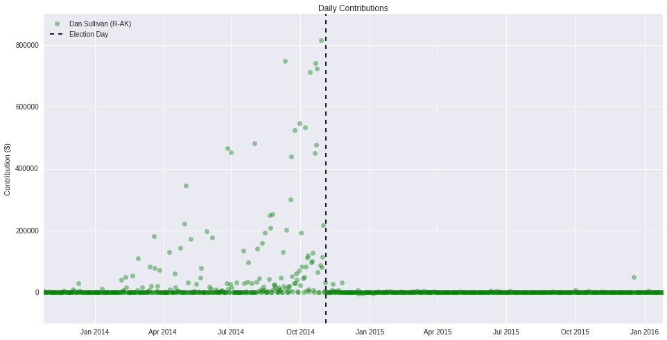
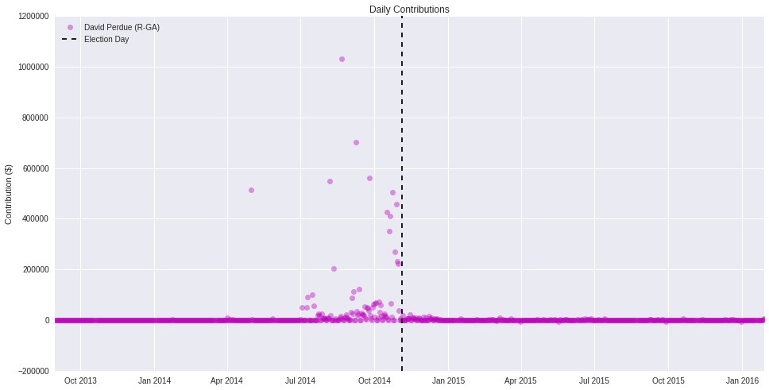
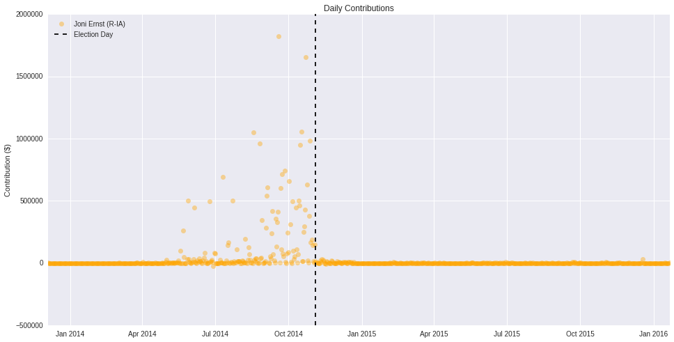
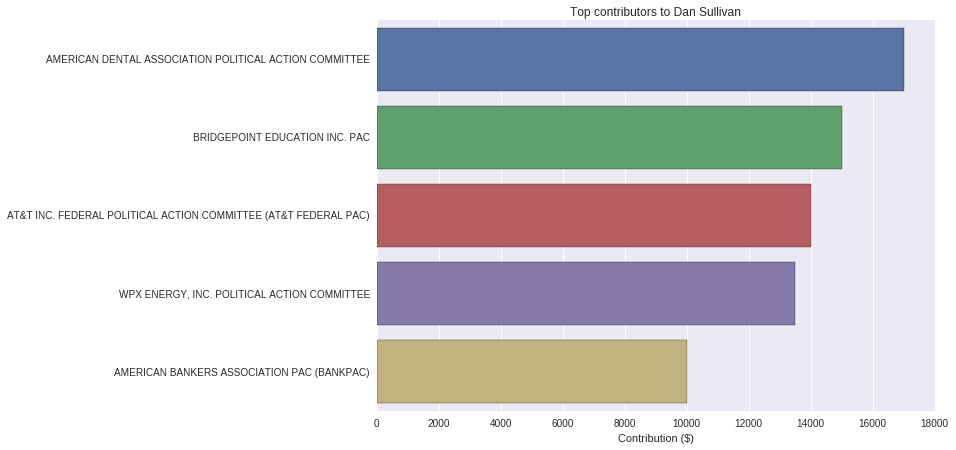
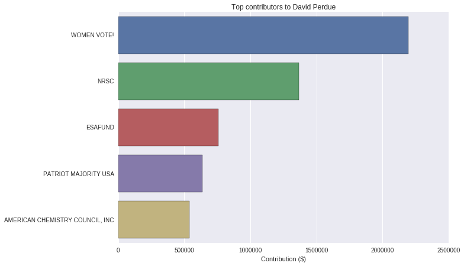
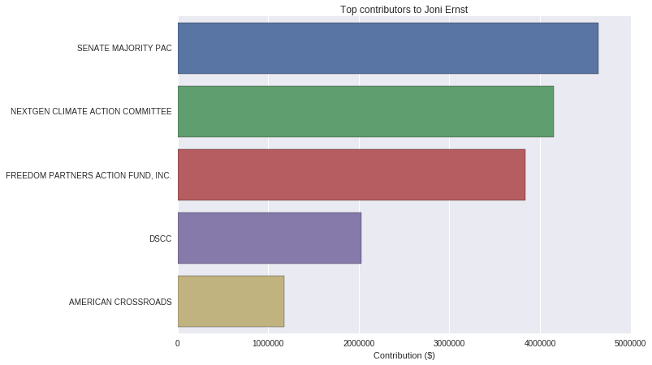
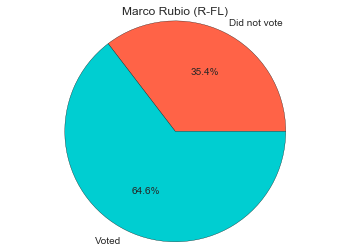
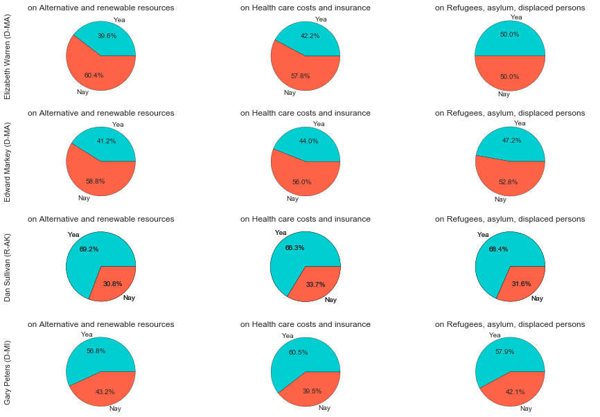

Mid Project Checkin
===================

## Did you accomplish your goals? ##

Coming into the project, we planned to have accomplished the following tasks by the mid project checkin:

* Decide on what story we want to tell
* Outline the set of visualization we will display
* Have about half of the necessary figures completed

At this point, we've generated a good number of figures, but we haven't finalized what story our inforgraphic will tell. We will continue to look at the visualizations that we've generated and soon be able to decide on what the message of our project will be. Although we don't have everything completed that we hoped to, we think it won't take much time to get our story worked out.

## What have you accomplished thus far in the project? ##

### Data Wrangling ###

A great deal of the work we did so far was acquiring and cleaning our data. We found information about congressional candidates, contributions, and voting from a few websites in various formats. We generated a sqlite database with tables linking candidates, contributions, and committees using this data. We also created a csv file for the voting records of all of the congressmen for recent bills.

### Exploration ###

In order to decide on what story to tell, we decided to see what the data reported. The first thing we looked at was the role of contributions in a senator's election. We looked into this by visualizing the contributions given to candidates over time.

We also looked at which committees contributed most to each candidate. We want to use this information to see how often the candidate sponsors and votes for bills supported by that interest group.

Another factor we wanted to investigate was the influence of each senator. We started to look into this idea by visualizing how often each senator actually votes. Later, We plan to also plot how often bills pass when a senator votes for them and how often bills fail when a senator votes against them.

A final factor we wanted to study was which topics senators were most concerned with. Different bills have different topics of interest, so we can see a senator's concern with a given topic by looking at how often they sponsor and vote for bills with that topic.

## What is the minimum viable product that you will have done by next Friday? ##

Next Friday, we will display a beautiful inforgraphic that shows the influence of different senators in congress and details the role of committee contributions to elections and voting habits. The product will include multiple visualizations and text to communicate our findings. Our minimum viable product will take the form of a poster.

## What are your stretch goals? ##

Along with the poster, we would like to create a tool for citizens interested in learning about their senators. This data powered tool would take the form of a jupyter notebook. People will be able to access the notebook from their browser and generate visualizations about their state's senators. By looking at these figures, citizen's will be able to gain a better understanding of what topics are most important to their senator and which committees contribute the most to them. We hope this tool will increase transparency into the role of contributions on the voting record of senators.
